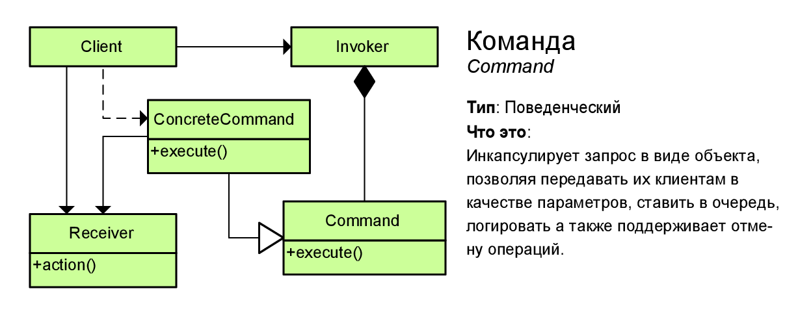

# Команда (Command)



Паттерн "Команда" (Command) позволяет инкапсулировать запрос на выполнение определенного действия в виде отдельного объекта. Этот объект запроса на действие и называется командой. При этом объекты, инициирующие запросы на выполнение действия, отделяются от объектов, которые выполняют это действие.

Команды могут использовать параметры, которые передают ассоциированную с командой информацию. Кроме того, команды могут ставиться в очередь и также могут быть отменены.

> ## Когда использовать команды?
> * Когда надо передавать в качестве параметров определенные действия, вызываемые в ответ на другие действия. То есть когда необходимы функции обратного действия в ответ на определенные действия.
>
> * Когда необходимо обеспечить выполнение очереди запросов, а также их возможную отмену.
>
> * Когда надо поддерживать логгирование изменений в результате запросов. Использование логов может помочь восстановить состояние системы - для этого необходимо будет использовать последовательность запротоколированных команд.

## Example
```csharp
class Program
{
    static void Main(string[] args)
    {
        CommandStack stack = new CommandStack();
        Player player = new Player();

        stack.ExecuteCommand(new HealthRewind(player));
        stack.UndoLastCommand();
    }
}
```
### Receiver
```csharp
public class Player
{
    private float health;

    public Player(float startHealth)
    {
        health = startHealth;
    }

    public void AddHealth(float health)
    {
        this.health += health;

        if(this.health < 0)
            this.health = 0;
    }
}
```
### Abstract command
```csharp
public interface ICommand
{
    void Execute();
    void Undo();
}
```
### Concrete command
```csharp
public class HealthRewind : ICommand
{
    private readonly Player player;
    private float deltaHealth;

    public HealthRewind(Player player, float deltaHealth)
    {
        this.player = player;
        this.deltaHealth = deltaHealth;
    }

    public override void Execute()
    {
        player.AddHealth(deltaHealth);
    }

    public override void Undo()
    {
        player.AddHealth(-deltaHealth);
    }
}
```
### Invoker
```csharp
public class CommandStack
{
    private Stack<ICommand> commandHistory = new Stack<ICommand>();

    public void ExecuteCommand(ICommand command)
    {
        command.Execute();
        commandHistory.Push(command);
    }

    public void UndoLastCommand()
    {
        if(commandHistory.Count == 0)
            return;
        
        commandHistory.Pop().Undo();
    }
}
```
