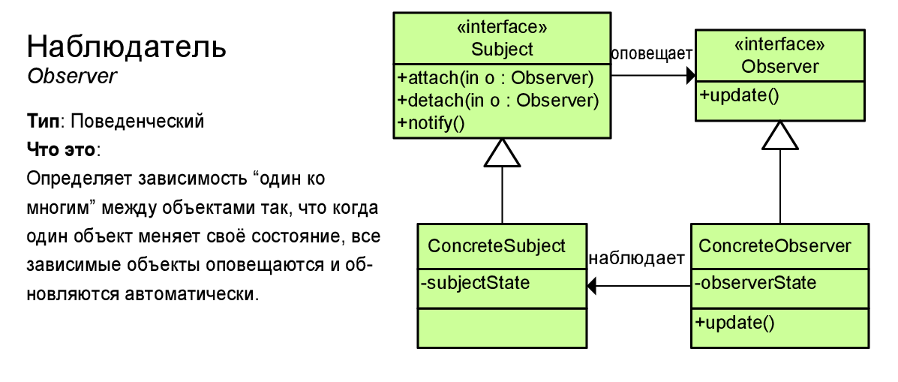

# Наблюдатель (Observer)



Паттерн "Наблюдатель" (Observer) представляет поведенческий шаблон проектирования, который использует отношение "один ко многим". В этом отношении есть один наблюдаемый объект и множество наблюдателей. И при изменении наблюдаемого объекта автоматически происходит оповещение всех наблюдателей.

Данный паттерн еще называют Publisher-Subscriber (издатель-подписчик), поскольку отношения издателя и подписчиков характеризуют действие данного паттерна: подписчики подписываются email-рассылку определенного сайта. Сайт-издатель с помощью email-рассылки уведомляет всех подписчиков о изменениях. А подписчики получают изменения и производят определенные действия: могут зайти на сайт, могут проигнорировать уведомления и т.д.

> ## Когда использовать паттерн Наблюдатель?
> * Когда система состоит из множества классов, объекты которых должны находиться в согласованных состояниях
> 
> * Когда общая схема взаимодействия объектов предполагает две стороны: одна рассылает сообщения и является главным, другая получает сообщения и реагирует на них. Отделение логики обеих сторон позволяет их рассматривать независимо и использовать отдельно друга от друга.
> 
> * Когда существует один объект, рассылающий сообщения, и множество подписчиков, которые получают сообщения. При этом точное число подписчиков заранее неизвестно и процессе работы программы может изменяться.

## Example
```csharp
class Program
{
	static void Main(string[] args)
	{
		NewsAgregator newsAgregator = new NewsAgregator();
		Reader steve = new Reader("Steve");
		Reader bill = new Reader("Bill");

		newsAgregator.Subscribe(steve);
		newsAgregator.Subscribe(bill);

		News news1 = new News("Title1", "Content1");
		News news2 = new News("Title2", "Content2");

		newsAgregator.Notify(news1);
		newsAgregator.Unsubscribe(steve);

		newsAgregator.Notify(news2);
		newsAgregator.Unsubscribe(bill);
	}
}
```
### Interface definitions
```csharp
public interface IObserver<T>
{
	void Update(T data);
}

public interface IObservable<T>
{
	void Subscribe(IObserver<T> observer);
	void Unsubscribe(IObserver<T> observer);
	void Notify(T data);
}
```

### Observer
```csharp
public class Reader : IObserver<News>
{
	public string Name { get; set; }

	public Reader(string name)
	{
		Name = name;
	}

	public void Update(News data)
	{
		Console.WriteLine($"{Name} read {data.Title} : {data.Content}");
	}
}
```
### Observable
```csharp
public class NewsAgregator : IObservable<News>
{
	private readonly List<IObserver<News>> observers;

	public NewsAgregator()
	{
		observers = new List<IObserver<News>>();
	}

	public void Subscribe(IObserver<News> observer)
	{
		observers.Add(observer);
	}

	public void Unsubscribe(IObserver<News> observer)
	{
		observers.Remove(observer);
	}

	public void Notify(News data)
	{
		foreach (IObserver<News> observer in observers)
		{
			observer.OnNext(data);
		}
	}
}
```
### Notify parameter
```csharp
public sealed class News
{
	public string Title { get; }
	public string Content { get; }

	public News(string titile, string content)
	{
		Title = titile;
		Content = content;
	}
}
```
## RX version example
```csharp
class Program
{
	static void Main(string[] args)
	{
		NewsAgregator newsAgregator = new NewsAgregator();
		Reader steve = new Reader("Steve");
		Reader bill = new Reader("Bill");

		IDisposable steveSubscription = newsAgregator.Subscribe(steve);
		IDisposable billSubscription = newsAgregator.Subscribe(bill);

		News news1 = new News("Title1", "Content1");
		News news2 = new News("Title2", "Content2");

		newsAgregator.Notify(news1);
		steveSubscription.Dispose();

		newsAgregator.Notify(news2);
		billSubscription.Dispose();
	}
}
```
### Observer
```csharp
public class Reader : IObserver<News>
{
	public string Name { get; set; }

	public Reader(string name)
	{
		Name = name;
	}

	public void OnNext(News data)
	{
		Console.WriteLine($"{Name} read {data.Title} : {data.Content}");
	}

	public void OnError(Exception error)
	{
		Console.ForegroundColor = ConsoleColor.DarkRed;
		Console.WriteLine(error.Message);
		Console.ResetColor();
	}

	public void OnCompleted()
	{}
}
```

### Observable
```csharp
public class NewsAgregator : IObservable<News>
{
	private readonly List<IObserver<News>> observers;

	public NewsAgregator()
	{
		observers = new List<IObserver<News>>();
	}

	public IDisposable Subscribe(IObserver<News> observer)
	{
		observers.Add(observer);

		return new Unsubscriber<News>(observers, observer);
	}

	public void Notify(News news)
	{
		foreach (IObserver<News> observer in observers)
		{
			observer.OnNext(news);
		}
	}
}
```

### Unsubscriber
```csharp
public class Unsubscriber<T> : IDisposable
{
	private readonly List<IObserver<T>> observers;
	private readonly IObserver<T> observer;

	public Unsubscriber(List<IObserver<T>> observers, IObserver<T> observer)
	{
		this.observers = observers;
		this.observer = observer;
	}

	public void Dispose()
	{
		if (observers.Contains(observer))
		{
			observers.Remove(observer);
		}
	}
}
```
## Преимущества и недостатки
<table>
	<tr>
		<td>
			
		</td>
		<td>
			Издатель не зависит от конкретных классов подписчиков.
		</td>
	</tr>
	<tr>
		<td>
			
		</td>
		<td>
			Вы можете подписывать и отписывать получателей на лету.
		</td>
	</tr>
	<tr>
		<td>
			
		</td>
		<td>
			Реализует принцип открытости/закрытости.
		</td>
	</tr>
	<tr>
		<td>
			
		</td>
		<td>
			Наблюдатели оповещаются в случайном порядке.
		</td>
	</tr>
</table>