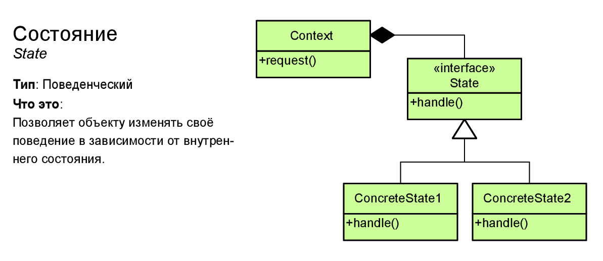

# Состояние (State)



Состояние (State) - шаблон проектирования, который позволяет объекту изменять свое поведение в зависимости от внутреннего состояния.

> ## Когда применяется данный паттерн?
> * Когда поведение объекта должно зависеть от его состояния и может изменяться динамически во время выполнения.
>
> * Когда в коде методов объекта используются многочисленные условные конструкции, выбор которых зависит от текущего состояния объекта.

## Example
```csharp
public class StateMachine
{
	public IState currentState;
	private IState previousState;

	private bool inTransition;

	public void ChangeState(IState newState)
	{
		if(currentState == newState || inTransition)
			return;
		
		ChangeStateRoutine(newState);
	}

	public void RevertState()
	{
		if(previousState != null)
			ChangeState(previousState);
	}

	private void ChangeStateRoutine(IState newState)
	{
		inTransition = true;

		currentState?.Exit();
		previousState = currentState;
		currentState = newState;
		currentState?.Enter();
		
		inTransition = false;
	}

	public void Update()
	{
		if(!inTransition)
			currentState?.Tick();
	}
}
```
### Abstract state
```csharp
public abstract class State
{
	protected StateMachine targetStateMachine;

	protected State(StateMachine stateMachine)
	{
		targetStateMachine = stateMachine;
	}

	protected virtual void Enter() {}
	protected virtual void Tick() {}
	protected virtual void Exit() {}
}
```
### Concrete states
```csharp
public class IdleState : State
{
	public IdleState(StateMachine stateMachine) : base(stateMachine)
	{}

	public override void Tick()
	{
		if(Input.GetKeyDown(KeyCode.Space))
		{
			targetStateMachine.ChangeState(new SearchState(targetStateMachine))
		}
	}
}

public class SearchState : State
{
	public IdleState(StateMachine stateMachine) : base(stateMachine)
	{}

	public override void Tick()
	{
		if(Input.GetKeyDown(KeyCode.Escape))
		{
			targetStateMachine.ChangeState(new IdleState(targetStateMachine))
		}
	}
}
```
## Преимущества и недостатки
<table>
	<tr>
		<td>
			
		</td>
		<td>
			Избавляет от множества больших условных операторов машины состояний.
		</td>
	</tr>
	<tr>
		<td>
			
		</td>
		<td>
			Концентрирует в одном месте код, связанный с определённым состоянием.
		</td>
	</tr>
	<tr>
		<td>
			
		</td>
		<td>
			Упрощает код контекста.
		</td>
	</tr>
	<tr>
		<td>
			
		</td>
		<td>
			Может неоправданно усложнить код, если состояний мало и они редко меняются.
		</td>
	</tr>
</table>