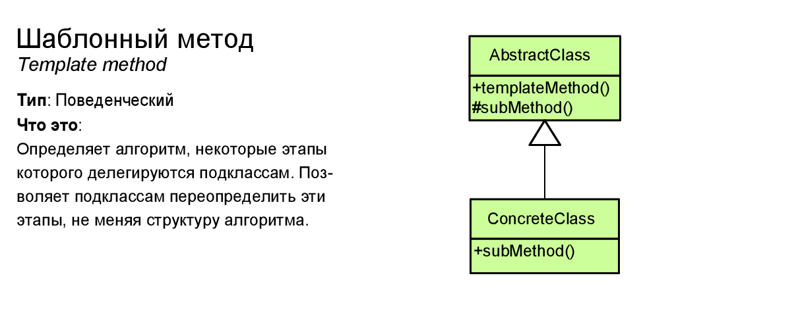

# Шаблонный метод (Template method)



Шаблонный метод (Template Method) определяет общий алгоритм поведения подклассов, позволяя им переопределить отдельные шаги этого алгоритма без изменения его структуры.

> ## Когда использовать шаблонный метод?
> * Когда планируется, что в будущем подклассы должны будут переопределять различные этапы алгоритма без изменения его структуры
>
> * Когда в классах, реализующим схожий алгоритм, происходит дублирование кода. Вынесение общего кода в шаблонный метод уменьшит его дублирование в подклассах.

> ## Особенности паттерна Template Method
> * Template Method использует наследование для модификации части алгоритма. Стратегия использует делегирование для модификации всего алгоритма.
>
> * Стратегия изменяет логику отдельных объектов. Template Method изменяет логику всего класса.
> 
> * Фабричные методы часто вызываются из шаблонных методов.

## Example
```csharp
class Program
{
	static void Main(string[] args)
	{
		Weapon[] arsenal = new Weapon[]
		{
			new Gun(),
			new Minigun()
		};

		foreach (var wepon in arsenal)
		{
			wepon.Use();
		}
	}
}
```
### Abstract template
```csharp
public abstract class Weapon
{
	public void Use()
	{
		Reload();
		// ...
		Shoot();
	}

	protected abstract void Reload();
	protected abstract void Shoot();
}
```
### Concrete template
```csharp
public class Gun : Weapon
{
	protected override void Reload()
	{
		Console.WriteLine("Reload gun");
	}

	protected override void Shoot()
	{
		Console.WriteLine("Gun shot");
	}
}

public class Minigun : Weapon
{
	protected override void Reload()
	{
		Console.WriteLine("Reload minigun");
	}

	protected override void Shoot()
	{
		Console.WriteLine("Minigun shot");
	}
}
```
## Преимущества и недостатки
<table>
	<tr>
		<td>
			
		</td>
		<td>
			Облегчает повторное использование кода.
		</td>
	</tr>
	<tr>
		<td>
			
		</td>
		<td>
			Вы жёстко ограничены скелетом существующего алгоритма.
		</td>
	</tr>
	<tr>
		<td>
			
		</td>
		<td>
			Вы можете нарушить принцип подстановки Барбары Лисков, изменяя базовое поведение одного из шагов алгоритма через подкласс.
		</td>
	</tr>
	<tr>
		<td>
			
		</td>
		<td>
			С ростом количества шагов, шаблонный метод становится слишком сложно поддерживать.
		</td>
	</tr>
</table>