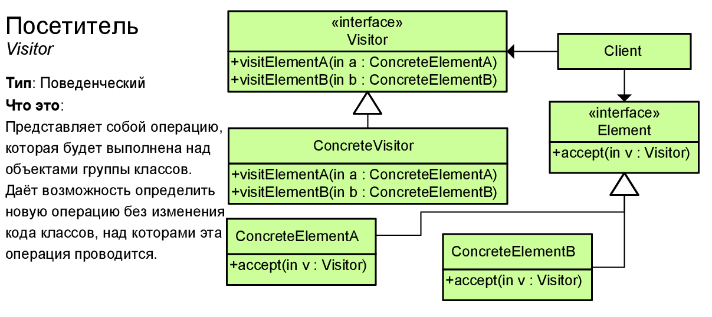

# Посетитель (Visitor)



Паттерн Посетитель (Visitor) позволяет определить операцию для объектов других классов без изменения этих классов.

При использовании паттерна Посетитель определяются две иерархии классов: одна для элементов, для которых надо определить новую операцию, и вторая иерархия для посетителей, описывающих данную операцию.

> ## Когда использовать данный паттерн?
> * Когда имеется много объектов разнородных классов с разными интерфейсами, и требуется выполнить ряд операций над каждым из этих объектов
>
> * Когда классам необходимо добавить одинаковый набор операций без изменения этих классов
>
> * Когда часто добавляются новые операции к классам, при этом общая структура классов стабильна и практически не изменяется

## Example
```csharp
class Program
{
	static void Main(string[] args)
	{
		IElement[] elements = new IElement[]
		{
			new ElementA(),
			new ElementB()
		};

		IVisitor[] visitors = new IVisitor[]
		{
			new ConcreteVisitor1(),
			new ConcreteVisitor2()
		};

		foreach (var visitor in visitors)
		{
			foreach (var element in elements)
			{
				element.Accept(visitor);
			}
		}
	}
}
```
### Abstract visitor
```csharp
public interface IVisitor
{
	void VisitElementA(ElementA element);
	void VisitElementB(ElementB element);
}
```
### Concrete visitors
```csharp
public class ConcreteVisitor1 : IVisitor
{
	public void VisitElementA(ElementA element)
	{
		element.OperationA();
		Console.WriteLine("ConcreteVisitor1");
	}

	public void VisitElementB(ElementB element)
	{
		element.OperationB();
		Console.WriteLine("ConcreteVisitor1");
	}
}

public class ConcreteVisitor2 : IVisitor
{
	public void VisitElementA(ElementA element)
	{
		element.OperationA();
		Console.WriteLine("ConcreteVisitor2");
	}

	public void VisitElementB(ElementB element)
	{
		element.OperationB();
		Console.WriteLine("ConcreteVisitor2");
	}
}
```
### Abstract element
```csharp
public interface IElement
{
	void Accept(IVisitor visitor);
}
```
### Concrete elements
```csharp
public class ElementA : IElement
{
	public void Accept(IVisitor visitor)
	{
		visitor.VisitElementA(this);
	}

	public void OperationA()
	{
		Console.Write("ElementA visited by ");
	}
}

public class ElementB : IElement
{
	public void Accept(IVisitor visitor)
	{
		visitor.VisitElementB(this);
	}

	public void OperationB()
	{
		Console.Write("ElementB visited by ");
	}
}
```
