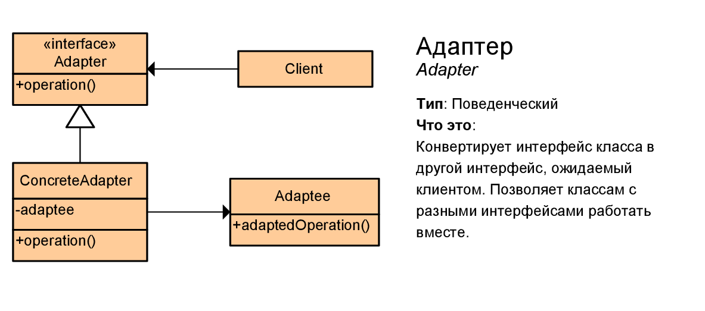

# Адаптер (Adapter)



Паттерн Адаптер (Adapter) предназначен для преобразования интерфейса одного класса в интерфейс другого. Благодаря реализации данного паттерна мы можем использовать вместе классы с несовместимыми интерфейсами.

> ## Когда надо использовать Адаптер?
> * Когда необходимо использовать имеющийся класс, но его интерфейс не соответствует потребностям
>
> * Когда надо использовать уже существующий класс совместно с другими классами, интерфейсы которых не совместимы

## Example
```csharp
class Program
{
	static void Main(string[] args)
	{
		Client client = new Client();
		Adaptee target = new Adaptee();

		client.Request(new Adapter(target));
	}
}
```
```csharp
public class Client
{
	public void Request(ITarget target)
	{
		target.Request();
	}
}
```
### Target interface
```csharp
public interface ITarget
{
	void Request();
}
```
### Adapter
```csharp
public class Adapter : ITarget
{
	private readonly Adaptee adaptee;

	public Adapter(Adaptee adaptee)
	{
		this.adaptee = adaptee;
	}

	public void Request()
	{
		adaptee.SpecificRequest();
	}
}
```
### Specific object
```csharp
public class Adaptee
{
	public void SpecificRequest()
	{
		Console.WriteLine("Specific request");
	}
}
```

## Преимущества и недостатки
<table>
	<tr>
		<td>
			
		</td>
		<td>
			Отделяет и скрывает от клиента подробности преобразования различных интерфейсов.
		</td>
	</tr>
	<tr>
		<td>
			
		</td>
		<td>
			Усложняет код программы за счёт дополнительных классов.
		</td>
	</tr>
</table>

