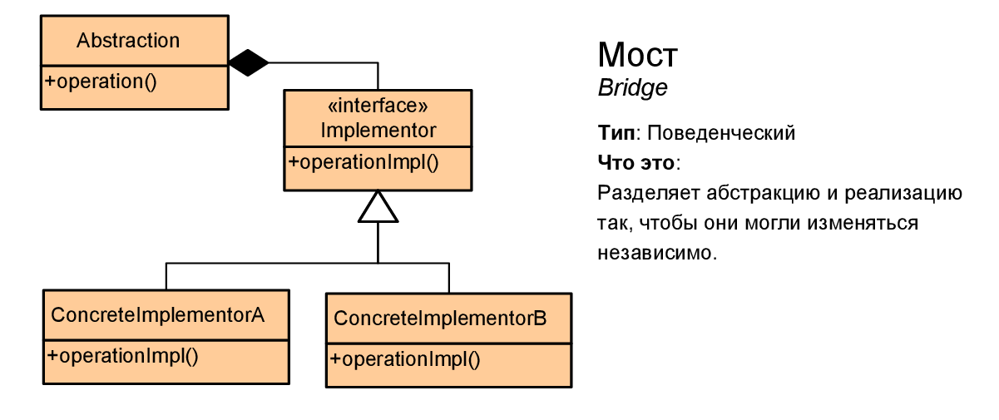

# Мост (Bridge)



Мост (Bridge) - структурный шаблон проектирования, который позволяет отделить абстракцию от реализации таким образом, чтобы и абстракцию, и реализацию можно было изменять независимо друг от друга.

Даже если мы отделим абстракцию от конкретных реализаций, то у нас все равно все наследуемые классы будут жестко привязаны к интерфейсу, определяемому в базовом абстрактном классе. Для преодоления жестких связей и служит паттерн Мост.

> ## Когда использовать данный паттерн?
> * Когда надо избежать постоянной привязки абстракции к реализации
>
> * Когда наряду с реализацией надо изменять и абстракцию независимо друг от друга. То есть изменения в абстракции не должно привести к изменениям в реализации

## Example
```csharp
class Program
{
	static void Main(string[] args)
	{
		ShootAttack shootAttack = new ShootAttack();
		PushAttack pushAttack = new PushAttack();

		Entity enetities = new Enetity[]
		{
			new Player(shootAttack),
			new Player(pushAttack),
			new Enemy(shootAttack),
			new Enemy(pushAttack)
		};

		foreach(var entity in entities)
		{
			entity.TakeAttack(10);
		}
	}
}
```
### Abstraction
```csharp
public class Entity
{
	protected IAttack attackSystem;

	protected Entity(IAttack attackSystem)
	{
		this.attackSystem = attackSystem;
	}

	public abstract void TakeAttack(float damage);
}
```
### Refined abstractions
```csharp
public class Player : Entity
{
	public Player(IAttack attackSystem) : base(attackSystem)
	{}

	public override void TakeAttack(float damage)
	{
		Console.Write("Player ");
		attackSystem.TakeAttack(damage);
	}
}

public class Enemy : Entity
{
	public Enemy(IAttack attackSystem) : base(attackSystem)
	{}

	public override void TakeAttack(float damage)
	{
		Console.Write("Enemy ");
		attackSystem.TakeAttack(damage);
	}
}
```
### Abstract implementor
```csharp
public interface IAttack
{
	void TakeAttack(float damage);
}
```
### Concrete implementors
```csharp
public class ShootAttack : IAttack
{
	public void TakeAttack(float damage)
	{
		Console.WriteLine($"attacks with a shot {damage} damage");
	}
}

public class PushAttack : IAttack
{
	public void TakeAttack(float damage)
	{
		Console.WriteLine($"attacks with a push {damage} damage");
	}
}
```