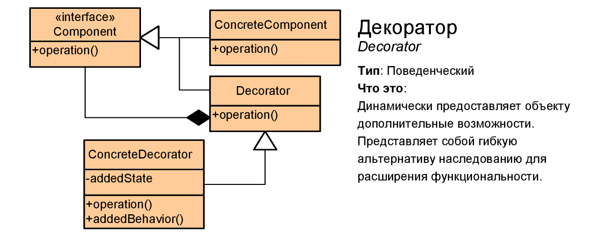

# Декоратор (Decorator)



Декоратор (Decorator) представляет структурный шаблон проектирования, который позволяет динамически подключать к объекту дополнительную функциональность.

Для определения нового функционала в классах нередко используется наследование. Декораторы же предоставляет наследованию более гибкую альтернативу, поскольку позволяют динамически в процессе выполнения определять новые возможности у объектов.

> ## Когда следует использовать декораторы?
> * Когда надо динамически добавлять к объекту новые функциональные возможности. При этом данные возможности могут быть сняты с объекта
> 
> * Когда применение наследования неприемлемо. Например, если нам надо определить множество различных функциональностей и для каждой функциональности наследовать отдельный класс, то структура классов может очень сильно разрастись. Еще больше она может разрастись, если нам необходимо создать классы, реализующие все возможные сочетания добавляемых функциональностей.

## Abstract example
```csharp
class Program
{
	static void Main(string[] args)
	{
		Component component = new ConcreteComponent();
		component = new ConcreteDecoratorA(component);
		component = new ConcreteDecoratorB(component);

		component.Operation();
	}
}
```
### Abstract component
```csharp
public abstract class Component
{
	public abstract void Operation();
}
```
### Concrete component
```csharp
public class ConcreteComponent : Component
{
	public override void Operation()
	{
		Console.writeLine("Concrete component");
	}
}
```
### Decorator
```csharp
public abstract class Decorator : Component
{
	protected readonly Component component;

	protected Decorator(Component component)
	{
		this.component = component;
	}

	public override void Operation()
	{
		component?.Operation();
	}
}
```
### Concrete decorators
```csharp
public class ConcreteDecoratorA : Decorator
{
	public ConcreteDecoratorA(Component component) : base(component)
	{}

	public override void Operation()
	{
		base.Operation();
		Console.WriteLine("Decorator A");
	}
}

public class ConcreteDecoratorB : Decorator
{
	public ConcreteDecoratorB(Component component) : base(component)
	{}

	public override void Operation()
	{
		base.Operation();
		Console.WriteLine("Decorator B");
	}
}
```
## Concrete example
### Client
```csharp
public class Player
{
	private PlayerCategory category = PlayerCategory.Employee;
	private PlayerSpecialization specialization = PlayerSpecialization.Mechanic;

	private IStatsProvider provider;

	public Player()
	{
		provider = new CategoryStats(category);
		provider = new SpecializationStats(provider, specialization);
		provider = new MultiplierStats(provider, 2);
	}

	public PlayerStats GetStats()
	{
		return provider.GetStats();
	}
}
```
### Enums
```csharp
public enum PlayerCategory
{
	Beggar,
	Employee,
	Rich
}

public enum PlayerSpecialization
{
	Mechanic,
	Pilot,
	Сhemist
}
```
### Component
```csharp
public interface IStatsProvider
{
	PlayerStats GetStats();
}
```
### Concrete component
```csharp
public class CategoryStats : IStatsProvider
{
	private readonly PlayerCategory category;

	public CategoryStats(PlayerCategory playerCategory)
	{
		this.category = playerCategory;
	}

	public PlayerStats GetStats()
	{
		switch (category)
		{
			case PlayerCategory.Beggar:
				return new PlayerStats()
				{
					Strength = 10,
					Agility = 6,
					Intelligence = 4,
					Stamina = 8
				};
			case PlayerCategory.Employee:
				return new PlayerStats()
				{
					Strength = 4,
					Agility = 8,
					Intelligence = 10,
					Stamina = 6
				};
			case PlayerCategory.Rich:
				return new PlayerStats()
				{
					Strength = 6,
					Agility = 10,
					Intelligence = 8,
					Stamina = 8
				};
			default:
				throw new NotImplementedException($"Category {category} doesn't implemented!");
		}
	}
}
```
### Decorator
```csharp
public abstract class StatsDecorator : IStatsProvider
{
	protected readonly IStatsProvider wrappedEntity;

	protected StatsDecorator(IStatsProvider wrappedEntity)
	{
		this.wrappedEntity = wrappedEntity;
	}

	public PlayerStats GetStats()
	{
		return GetStatsInternal();
	}

	protected abstract PlayerStats GetStatsInternal();
}
```
### Concrete decorators
```csharp
public class MultiplierStats : StatsDecorator
{
	private readonly float multiplier;
	public MultiplierStats(IStatsProvider wrappedEntity, float multiplier) : base(wrappedEntity)
	{
		this.multiplier = multiplier;
	}

	protected override PlayerStats GetStatsInternal()
	{
		return wrappedEntity.GetStats() * multiplier;
	}
}

public class SpecializationStats : StatsDecorator
{
	private readonly PlayerSpecialization specialization;
	public SpecializationStats(IStatsProvider wrappedEntity, PlayerSpecialization specialization) : base(wrappedEntity)
	{
		this.specialization = specialization;
	}

	protected override PlayerStats GetStatsInternal()
	{
		return wrappedEntity.GetStats() + GetSpecStats(specialization);
	}

	private PlayerStats GetSpecStats(PlayerSpecialization specialization)
	{
		switch (specialization)
		{
			case PlayerSpecialization.Mechanic:
				return new PlayerStats()
				{
					Strength = 1,
					Agility = 1,
					Intelligence = 5,
					Stamina = 7
				};
			case PlayerSpecialization.Pilot:
				return new PlayerStats()
				{
					Strength = 1,
					Agility = 1,
					Intelligence = 5,
					Stamina = 7
				};
			case PlayerSpecialization.Сhemist:
				return new PlayerStats()
				{
					Strength = 1,
					Agility = 1,
					Intelligence = 5,
					Stamina = 7
				};
			default:
				throw new NotImplementedException($"Category {specialization} doesn't implemented!");
		}
	}
}
```
### Player data
```csharp
public struct PlayerStats
{
	public float Strength { get; set; }
	public float Agility { get; set; }
	public float Intelligence { get; set; }
	public float Stamina { get; set; }

	public static PlayerStats operator + (PlayerStats left, PlayerStats right)
	{
		return new PlayerStats()
		{
			Strength = left.Strength + right.Strength,
			Agility = left.Agility + right.Agility,
			Intelligence = left.Intelligence + right.Intelligence,
			Stamina = left.Stamina + right.Stamina
		};
	}

	public static PlayerStats operator * (PlayerStats left, float value)
	{
		return new PlayerStats()
		{
			Strength = left.Strength * value,
			Agility = left.Agility * value,
			Intelligence = left.Intelligence + value,
			Stamina = left.Stamina * value
		};
	}
}
```